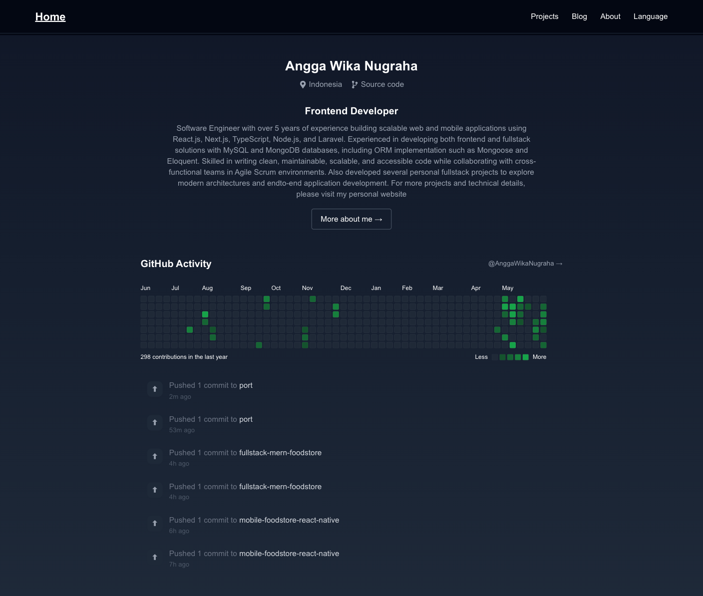
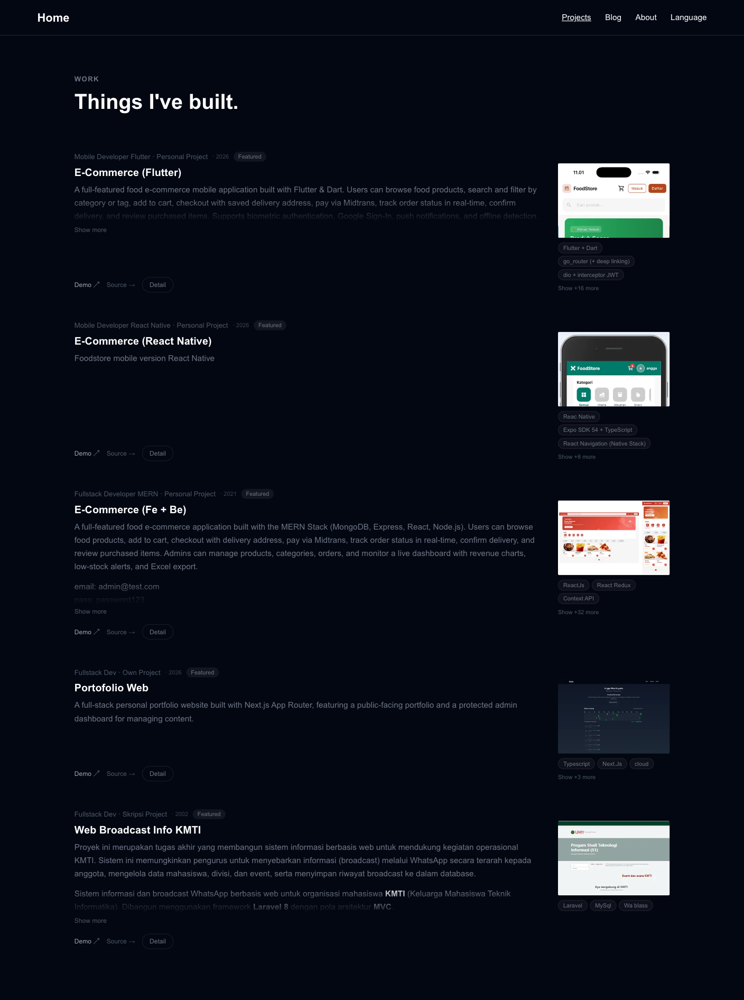
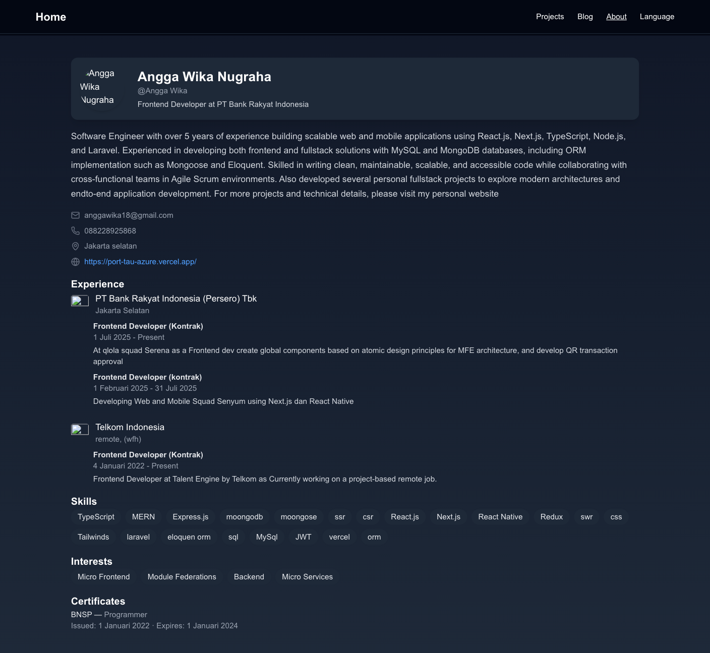
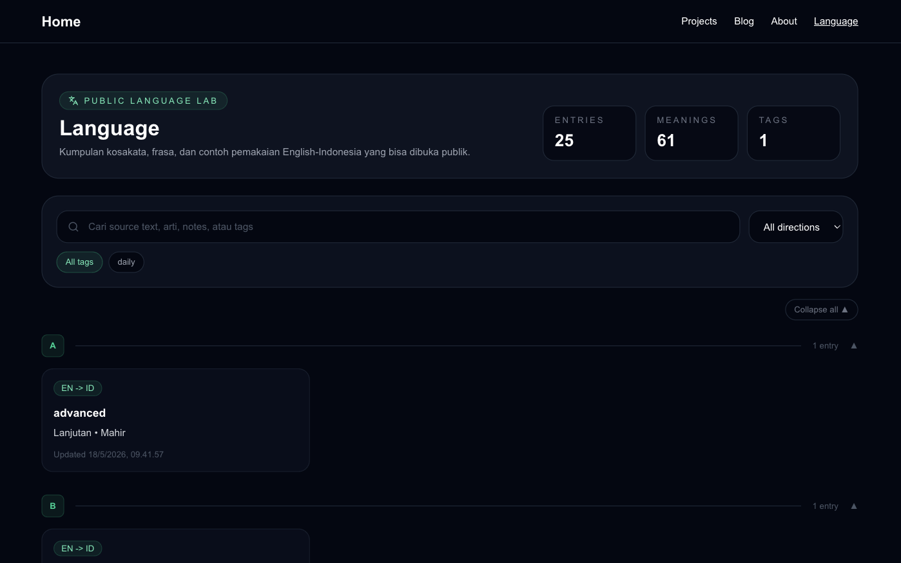

# Portfolio

[English](./README.md) · **Bahasa Indonesia**

Website portofolio pribadi full-stack yang dibangun dengan Next.js 15 App Router, MySQL, dan autentikasi JWT. Menyediakan portofolio publik (proyek beserta rincian flow, blog, about, language lab) dan dashboard admin terproteksi untuk mengelola konten — termasuk drag-to-reorder untuk proyek dan flow, upload gambar via Cloudinary, serta penampil gambar yang bisa di-zoom.

## Struktur Proyek

```
src/
├── app/
│   ├── page.tsx                        # Halaman home
│   ├── layout.tsx                      # Root layout + metadata
│   ├── globals.css
│   ├── icon.svg                        # Favicon (monogram AW)
│   ├── Layouts/MainLayout/             # Pembungkus navbar
│   ├── components/
│   │   ├── navbar/                     # Navigasi atas
│   │   ├── homePage/                   # header, about, postList
│   │   └── languageLab/                # UI language lab
│   ├── pages/
│   │   ├── about/                      # Halaman about publik
│   │   ├── blog/                       # Halaman blog publik
│   │   ├── language/                   # Language lab publik
│   │   ├── login/                      # Halaman login
│   │   └── projects/
│   │       ├── [id]/
│   │       │   ├── page.tsx            # Detail proyek
│   │       │   └── ZoomableImage.tsx   # Penampil gambar klik-untuk-zoom
│   │       ├── components/             # Daftar proyek + card
│   │       ├── services/
│   │       └── types/
│   ├── admin/
│   │   ├── dashboard/                  # Home admin + statistik
│   │   ├── language/                   # Admin language lab
│   │   └── profile/                    # Manajemen konten lengkap
│   └── api/
│       ├── auth/                       # login, set-password
│       ├── profile/                    # get, update
│       ├── public/                     # about, projects, language
│       └── admin/                      # CRUD terproteksi + reorder
│           ├── skills/                 # CRUD + reorder
│           ├── interests/              # CRUD + reorder
│           ├── projects/               # CRUD + reorder
│           ├── project-flows/          # CRUD + reorder
│           ├── experience/
│           ├── certificates/
│           ├── roles/
│           ├── language/
│           └── upload/                 # Upload Cloudinary
├── lib/
│   ├── db.ts                           # Connection pool MySQL
│   ├── projects.ts                     # Query proyek + flow
│   ├── language.ts
│   ├── admin-auth.ts
│   └── tgl.ts                          # Formatter tanggal
└── middleware.ts                       # Proteksi route via JWT
```
## Tech Stack

| Layer | Teknologi |
|---|---|
| Framework | Next.js 15 (App Router) |
| Bahasa | TypeScript |
| Styling | Tailwind CSS v4 |
| Database | MySQL via `mysql2/promise` |
| Auth | JWT + bcryptjs, cookie HttpOnly |
| Gambar | Cloudinary CDN |
| Ikon | lucide-react, react-icons |
| Markdown | react-markdown |
| Drag & Drop | Native HTML5 Drag API |

## Fitur

**Portofolio Publik**
- Halaman home dengan profile header, bagian about, dan postingan blog
- Halaman about berisi skill, pengalaman, pendidikan, dan sertifikasi
- Showcase proyek dengan tech stack, link live, dan rincian flow per proyek
- Penampil gambar yang bisa di-zoom pada detail proyek (scroll untuk zoom, drag untuk geser)
- Halaman blog
- Language lab (kamus belajar EN/ID)
- Kalender aktivitas GitHub

**Dashboard Admin** (terproteksi JWT)
- Ringkasan statistik (skill, interest, pengalaman, sertifikat)
- CRUD lengkap untuk: skill, interest, pengalaman, role, pendidikan, proyek, project flow, sertifikat
- Drag-to-reorder untuk proyek, flow, skill, dan interest (tersimpan ke DB)
- Editor profil (nama, bio, avatar, info kontak, job title)
- Upload gambar ke Cloudinary
- Manajemen language lab privat (kamus EN/ID)

## Flow

### Home Pengguna `/`



```
Pengguna membuka /
      |
      ▼
  Render ProfileHeader  (statis — nama di-hardcode)
      |
      ▼
  AboutSection — GET /api/public/about
      |
      ├─→ Error / tidak ada data → field dibiarkan kosong
      |
      └─→ 200 { job_title, bio, ... }
              |
              ▼
          Render job_title + bio
              |
              ▼
          Tombol "More about me →" → /pages/about
      |
      ▼
  PostList — GET https://api.github.com/users/AnggaWikaNugraha/events/public?per_page=10
      |
      ├─→ Error / kosong        → "No recent activity"
      |
      └─→ 200 events[]  (maks 6)
              |
              ▼
          GitHub Contribution Calendar  (react-github-calendar)
              |
              ▼
          Daftar Recent Activity  (tipe event, nama repo, waktu relatif)
```

### Proyek `/pages/projects`



```
Pengguna membuka /pages/projects
      |
      ▼
GET /api/public/projects
      |
      ├─→ Error                 → 500 { error: message }
      |
      └─→ 200
              |
              ▼
          SELECT projects WHERE user_id=1 AND is_private=0
          ORDER BY sort_order ASC, created_at DESC
              |
              └─→ per proyek: SELECT project_flows WHERE project_id=?
                              ORDER BY sort_order ASC
              |
              ▼
          Response Project[] (masing-masing dengan flows[])
              |
              ▼
          Render Daftar Proyek (satu card per proyek)
              ├─ Gambar cover, judul, role · perusahaan · tahun
              ├─ Deskripsi (bisa dilipat jika panjang)
              ├─ Pill tech stack
              └─ Link: Demo · Source · Detail
```

### Detail Proyek `/pages/projects/[id]`


```
Pengguna membuka /pages/projects/[id]
      |
      ▼
getPublicProjectById(id)  ← sisi server (lib/projects.ts)
      |
      ├─→ SELECT projects WHERE id=? AND is_private=0
      |         |
      |         └─→ Tidak ketemu → notFound()  (halaman 404)
      |
      └─→ Ketemu
              |
              ▼
          SELECT project_flows WHERE project_id=?
          ORDER BY sort_order ASC
              |
              ▼
          Render Detail Proyek
              ├─ Gambar cover  (ZoomableImage)
              │     └─→ Klik → overlay lightbox
              │             ├─ Scroll  → zoom in / out
              │             ├─ Drag    → geser
              │             └─ Esc / klik di luar → tutup
              ├─ Pill tech stack
              └─ Flows[]  (urut berdasarkan sort_order)
                    ├─ Gambar flow  (ZoomableImage)
                    └─ Deskripsi flow  (markdown)
```

### About `/pages/about`



```
Pengguna membuka /pages/about
      |
      ▼
GET /api/public/about
      |
      ├─→ User tidak ditemukan  → 404 { error: "No user found" }
      ├─→ Error                 → 500 { error: message }
      |
      └─→ 200
              |
              ▼  (query DB paralel)
              ├─ SELECT users LIMIT 1
              ├─ SELECT user_skills       ORDER BY sort_order ASC
              ├─ SELECT user_interests    ORDER BY sort_order ASC
              ├─ SELECT experience        ORDER BY created_at ASC
              │     └─ SELECT roles WHERE experience_id  ORDER BY start_date DESC
              └─ SELECT certificates      ORDER BY issue_date DESC
              |
              ▼
          Response { name, bio, avatar_url, job_title, email, phone,
                     location, website, skills[], interests[],
                     experience[{ company, roles[] }], certificates[] }
              |
              ▼
          Render Halaman About
              ├─ AvatarSection    (avatar, nama, job_title)
              ├─ InfoSection      (email, telepon, lokasi, website)
              ├─ ExperienceSection (perusahaan, logo, role)
              ├─ EducationSection  (saat ini kosong)
              ├─ SkillsSection    (skills[], interests[])
              └─ CertificatesSection (certificates[])
```

### Language `/pages/language`



```
Pengguna membuka /pages/language
      |
      ▼
GET /api/public/language  (baca saja, tanpa auth)
      |
      ├─→ Error                 → 500 { error: message }
      |
      └─→ 200
              |
              ▼
          ensureLanguageEntriesTable()  ← CREATE TABLE IF NOT EXISTS
              |
              ▼
          SELECT language_entries WHERE user_id=1
          ORDER BY updated_at DESC, created_at DESC
              |
              ▼
          Response {
            entries[],          ← meanings & tags di-parse dari JSON
            availableTags[],    ← tag unik, diurutkan A-Z
            stats: { entries, meanings, tags }
          }
              |
              ▼
          Render LanguageLab (mode="public")
              ├─ Card statistik  (total entri, meaning, tag)
              ├─ Kolom pencarian (filter berdasarkan sourceText, meanings, tags)
              ├─ Filter tag      (filter berdasarkan availableTags)
              └─ Daftar entri    (sourceText, meanings[], contoh, catatan)
                    ⚠ mode="public" → form tambah / edit / hapus tidak ditampilkan
```
### Blog `/pages/blog`

```
Pengguna membuka /pages/blog
      |
      ▼
  getBlogFeed()  ← data statis di-hardcode (tanpa panggilan API)
      |
      ▼
  setTimeout 1000ms  (simulasi loading)
      |
      ├─→ posts di-set []   → "No posts available."
      |
      └─→ (nanti) posts[]   → Render daftar BlogCard
```

### Dashboard Admin


```
Admin membuka dashboard
      |
      ▼
middleware.ts — verifikasi cookie JWT (token)
      |
      ├─→ Tidak ada cookie / invalid → redirect ke halaman login
      |
      └─→ JWT valid
              |
              ▼
          GET /api/admin/skills
          GET /api/admin/interests
          GET /api/admin/experience
          GET /api/admin/certificates
              |   (fetch paralel, useEffect sisi klien)
              ▼
          Response
              ├─ skills[]        → jumlah
              ├─ interests[]     → jumlah
              ├─ experience[]    → jumlah
              └─ certificates[]  → jumlah
              |
              ▼
          Render Card Statistik
              ├─ Jumlah skill
              ├─ Jumlah interest
              ├─ Jumlah pengalaman
              └─ Jumlah sertifikat
```

### Profil Admin


```
Admin membuka halaman profil
      |
      ▼
middleware.ts — verifikasi cookie JWT
      |
      ├─→ Invalid / tanpa token → redirect ke halaman login
      |
      └─→ Valid
              |
              ▼  (fetch paralel saat mount)
              ├─ GET /api/profile
              ├─ GET /api/admin/skills
              ├─ GET /api/admin/interests
              ├─ GET /api/admin/experience
              ├─ GET /api/admin/certificates
              └─ GET /api/admin/projects
              |
              ▼
          Render tab: Profile · Skills · Interests · Experience · Certificates · Projects

── Tab: Profile ──────────────────────────────────────────
  Edit field (name, bio, avatar_url, job_title, …)
      |
      ▼  [Save]
  POST /api/profile/update  { name, bio, avatar_url, … }
      └─→ { success: true }

── Tab: Skills ───────────────────────────────────────────
  [Add]   POST /api/admin/skills/create   { skill }
              └─→ refresh GET /api/admin/skills
  [Delete] POST /api/admin/skills/delete  { id }
              └─→ refresh GET /api/admin/skills
  [Drag]  POST /api/admin/skills/reorder  { ids[] }
              └─→ { success: true }

── Tab: Interests ────────────────────────────────────────
  [Add]   POST /api/admin/interests/create   { interest }
              └─→ refresh GET /api/admin/interests
  [Delete] POST /api/admin/interests/delete  { id }
              └─→ refresh GET /api/admin/interests
  [Drag]  POST /api/admin/interests/reorder  { ids[] }
              └─→ { success: true }

── Tab: Experience ───────────────────────────────────────
  [Add]   POST /api/admin/experience/create  { company, companyLogoUrl, location }
              └─→ refresh GET /api/admin/experience
  [Save]  POST /api/admin/experience/update  { id, company, … }
              └─→ { success: true }
  [Delete] POST /api/admin/experience/delete { id }
              └─→ refresh GET /api/admin/experience
  [Add Role]    POST /api/admin/roles/create  { experienceId, title, … }
  [Save Role]   POST /api/admin/roles/update  { id, title, … }
  [Delete Role] POST /api/admin/roles/delete  { id }

── Tab: Certificates ─────────────────────────────────────
  [Add]   POST /api/admin/certificates/create  { title, issuer, issue_date, … }
              └─→ refresh GET /api/admin/certificates
  [Save]  POST /api/admin/certificates/update  { id, title, … }
              └─→ { success: true }
  [Delete] POST /api/admin/certificates/delete { id }
              └─→ refresh GET /api/admin/certificates

── Tab: Projects ─────────────────────────────────────────
  [Add]   POST /api/admin/projects/create  { title, techStack[], … }
              └─→ { success: true, id }  → refresh GET /api/admin/projects
  [Save]  POST /api/admin/projects/update  { id, title, … }
              └─→ { success: true }
  [Delete] POST /api/admin/projects/delete { id }
              └─→ refresh GET /api/admin/projects
  [Drag proyek] POST /api/admin/projects/reorder  { ids[] }
              └─→ { success: true }  → sort_order diperbarui di DB

  Per proyek — aksi Flow:
  [Add Flow]    POST /api/admin/project-flows/create  { projectId, title, imageUrl, description }
  [Save Flow]   POST /api/admin/project-flows/update  { id, title, imageUrl, description }
  [Delete Flow] POST /api/admin/project-flows/delete  { id }
  [Drag flow]   POST /api/admin/project-flows/reorder { ids[] }
              └─→ sort_order tersimpan; halaman detail publik mengikuti urutan baru

  Upload gambar (cover / flow):
  POST /api/admin/upload  multipart/form-data { file }
      └─→ { url }  (URL Cloudinary CDN)
```
### Admin Language


```
Admin membuka halaman admin language
      |
      ▼
middleware.ts — verifikasi cookie JWT
      |
      ├─→ Invalid / tanpa token → redirect ke halaman login
      |
      └─→ Valid
              |
              ▼
GET /api/admin/language
      |
      ▼
ensureLanguageEntriesTable()  ← CREATE TABLE IF NOT EXISTS
      |
      ▼
SELECT language_entries WHERE user_id=1
ORDER BY updated_at DESC, created_at DESC
      |
      ▼
Response {
  entries[],       ← meanings & tags di-parse dari JSON
  availableTags[], ← tag unik, diurutkan A-Z
  stats: { entries, meanings, tags }
}
      |
      ▼
Render LanguageLab (mode="admin")
    ├─ Card statistik  (entri, meaning, tag)
    ├─ Kolom pencarian (filter berdasarkan sourceText, meanings, tags, contoh, catatan)
    ├─ Filter arah     (All / EN→ID / ID→EN)
    ├─ Filter tag      (filter berdasarkan availableTags)
    ├─ Tombol [Add Entry] → buka form pembuatan
    └─ Daftar entri dikelompokkan A-Z  (klik card → modal edit)

── Buat Entri ────────────────────────────────────────────
  [Save Entry]
  POST /api/admin/language/create
  { sourceText, sourceLang, targetLang, meanings[],
    exampleSource?, exampleTarget?, notes?, tags[] }
      └─→ { success: true, id }
              └─→ refresh GET /api/admin/language

── Edit Entri  (modal) ───────────────────────────────────
  [Save]
  POST /api/admin/language/update
  { id, sourceText, sourceLang, targetLang, meanings[],
    exampleSource?, exampleTarget?, notes?, tags[] }
      └─→ { success: true }
              └─→ refresh GET /api/admin/language

── Hapus Entri (modal) ───────────────────────────────────
  [Delete]
  POST /api/admin/language/delete  { id }
      └─→ { success: true }
              └─→ refresh GET /api/admin/language
```

## Endpoint API

### Auth

**POST `/api/auth/login`**
```json
// Request
{ "email": "string", "password": "string" }
// Response 200 — menyetel cookie token HttpOnly
{ "success": true }
// Error: 404 User not found · 401 Wrong password · 400 No password set
```

**POST `/api/auth/set-password`**
```json
// Request
{ "email": "string", "password": "string" }
// Response
{ "success": true, "message": "Password updated" }
```

---

### Profile (butuh cookie JWT)

**GET `/api/profile`**
```json
// Response
{
  "id": "string", "name": "string", "username": "string",
  "bio": "string", "email": "string", "phone": "string",
  "location": "string", "avatar_url": "string",
  "job_title": "string", "company": "string", "website": "string"
}
```

**POST `/api/profile/update`**
```json
// Request — semua field opsional
{
  "name": "string", "username": "string", "bio": "string",
  "email": "string", "phone": "string", "location": "string",
  "avatar_url": "string", "job_title": "string",
  "company": "string", "website": "string"
}
// Response
{ "success": true }
```

---

### Public

**GET `/api/public/about`**
```json
// Response
{
  "id": "string", "name": "string", "bio": "string",
  "avatar_url": "string", "job_title": "string",
  "skills": ["string"],
  "interests": ["string"],
  "experience": [{
    "id": "string", "company": "string", "companyLogoUrl": "string", "location": "string",
    "roles": [{
      "id": "string", "title": "string", "employmentType": "string",
      "startDate": "date", "endDate": "date | null", "description": "string"
    }]
  }],
  "certificates": [{
    "id": "string", "title": "string", "issuer": "string",
    "issueDate": "date", "expirationDate": "date", "credentialUrl": "string"
  }]
}
```

**GET `/api/public/projects`**
```json
// Response
[{
  "id": "string", "title": "string", "description": "string",
  "role": "string", "company": "string", "techStack": ["string"],
  "year": "number", "status": "completed | in-progress | archived",
  "featured": "boolean", "demoUrl": "string", "repoUrl": "string",
  "coverImage": "string",
  "flows": [{
    "id": "string", "title": "string", "description": "string",
    "imageUrl": "string", "sortOrder": "number"
  }]
}]
```

**GET `/api/public/language`**
```json
// Response — entri language lab (publik, baca saja)
[{ "id": "string", "sourceText": "string", "sourceLang": "string",
   "targetLang": "string", "meanings": ["string"], "tags": ["string"] }]
```

---

### Admin — Skills (butuh cookie JWT)

**GET `/api/admin/skills`**
```json
// Response
[{ "id": "string", "skill": "string" }]
```

**POST `/api/admin/skills/create`**
```json
// Request
{ "skill": "string" }
// Response
{ "success": true }
```

**POST `/api/admin/skills/delete`**
```json
// Request
{ "id": "string" }
// Response
{ "success": true }
```

**POST `/api/admin/skills/reorder`**
```json
// Request — array berisi seluruh ID skill sesuai urutan
{ "ids": ["string"] }
// Response
{ "success": true }
```

---

### Admin — Interests (butuh cookie JWT)

**GET `/api/admin/interests`**
```json
[{ "id": "string", "interest": "string" }]
```

**POST `/api/admin/interests/create`** · `{ "interest": "string" }`

**POST `/api/admin/interests/delete`** · `{ "id": "string" }`

**POST `/api/admin/interests/reorder`** · `{ "ids": ["string"] }`

Semuanya membalas `{ "success": true }`.

---

### Admin — Projects (butuh cookie JWT)

**GET `/api/admin/projects`**
```json
// Response — bentuk sama seperti public/projects, termasuk flows
[{ "id": "string", "title": "string", "sortOrder": "number", "isPrivate": "boolean", "flows": [] }]
```

**POST `/api/admin/projects/create`**
```json
// Request
{
  "title": "string",
  "description": "string?", "role": "string?", "company": "string?",
  "techStack": ["string"], "year": "number?",
  "status": "completed | in-progress | archived",
  "featured": "boolean", "isPrivate": "boolean",
  "demoUrl": "string?", "repoUrl": "string?", "coverImage": "string?"
}
// Response
{ "success": true, "id": "string" }
```

**POST `/api/admin/projects/update`** — field sama seperti create + `"id": "string"` → `{ "success": true }`

**POST `/api/admin/projects/delete`** · `{ "id": "string" }` → `{ "success": true }`

**POST `/api/admin/projects/reorder`** · `{ "ids": ["string"] }` → `{ "success": true }`

---

### Admin — Project Flows (butuh cookie JWT)

**POST `/api/admin/project-flows/create`**
```json
// Request
{ "projectId": "string", "title": "string?", "description": "string?", "imageUrl": "string?" }
// Response
{ "success": true, "id": "string" }
```

**POST `/api/admin/project-flows/update`**
```json
{ "id": "string", "title": "string?", "description": "string?", "imageUrl": "string?" }
// Response
{ "success": true }
```

**POST `/api/admin/project-flows/delete`** · `{ "id": "string" }` → `{ "success": true }`

**POST `/api/admin/project-flows/reorder`** · `{ "ids": ["string"] }` → `{ "success": true }`

---

### Admin — Experience (butuh cookie JWT)

**GET `/api/admin/experience`**
```json
[{
  "id": "string", "company": "string", "companyLogoUrl": "string", "location": "string",
  "roles": [{
    "id": "string", "title": "string", "employmentType": "string",
    "startDate": "date", "endDate": "date | null", "description": "string"
  }]
}]
```

**POST `/api/admin/experience/create`** · `{ "company": "string", "companyLogoUrl": "string", "location": "string" }` → `{ "success": true }`

**POST `/api/admin/experience/update`** · `{ "id": "string", "company": "string", "companyLogoUrl": "string", "location": "string" }` → `{ "success": true }`

**POST `/api/admin/experience/delete`** · `{ "id": "string" }` → `{ "success": true }`

---

### Admin — Roles (butuh cookie JWT)

**POST `/api/admin/roles/create`**
```json
{
  "experienceId": "string", "title": "string", "employmentType": "string",
  "startDate": "date", "endDate": "date?", "description": "string?"
}
// Response
{ "success": true, "id": "string" }
```

**POST `/api/admin/roles/update`** · field sama + `"id"` → `{ "success": true }`

**POST `/api/admin/roles/delete`** · `{ "id": "string" }` → `{ "success": true }`

---

### Admin — Certificates (butuh cookie JWT)

**GET `/api/admin/certificates`**
```json
[{ "id": "string", "title": "string", "issuer": "string",
   "issue_date": "date", "expiration_date": "date", "credential_url": "string" }]
```

**POST `/api/admin/certificates/create`** · `{ "title", "issuer", "issue_date", "expiration_date", "credential_url" }` → `{ "success": true }`

**POST `/api/admin/certificates/update`** · sama + `"id"` → `{ "success": true }`

**POST `/api/admin/certificates/delete`** · `{ "id": "string" }` → `{ "success": true }`

---

### Admin — Language (butuh cookie JWT)

**GET `/api/admin/language`** → payload language lengkap

**POST `/api/admin/language/create`**
```json
{
  "sourceText": "string", "sourceLang": "string", "targetLang": "string",
  "meanings": ["string"], "exampleSource": "string?", "exampleTarget": "string?",
  "notes": "string?", "tags": ["string"]
}
// Response
{ "success": true, "id": "string" }
```

**POST `/api/admin/language/update`** · sama + `"id"` → `{ "success": true }`

**POST `/api/admin/language/delete`** · `{ "id": "string" }` → `{ "success": true }`

---

### Admin — Upload (butuh cookie JWT)

**POST `/api/admin/upload`**
```
// Request: multipart/form-data
file: File (gambar)
// Response
{ "url": "string" }  // URL Cloudinary CDN
// Error: { "error": "No file provided" } 400
```
